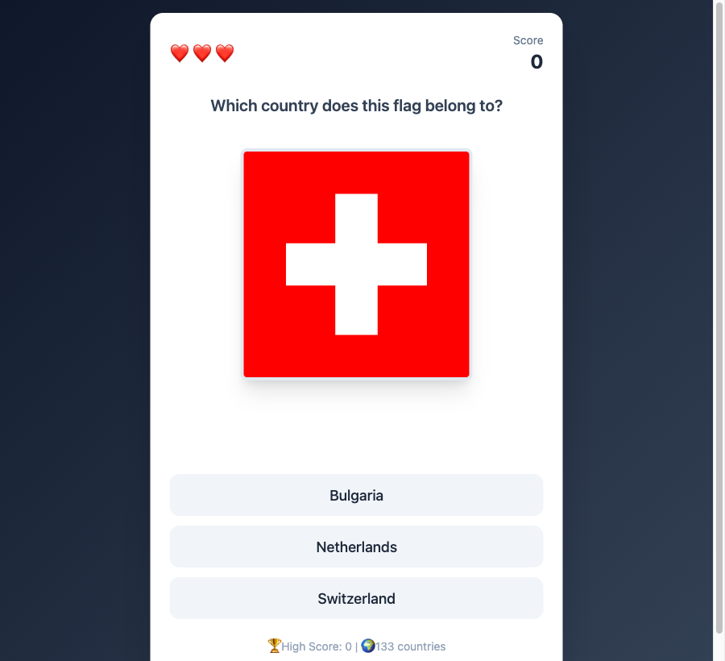

# Flag Learning Game 🌍

A fun and interactive web application to test your knowledge of world flags! Built with React, Vite, and Tailwind CSS.



## 🎮 How to Play

1. A flag will appear on the screen.
2. You will be presented with 3 options.
3. Choose the correct country that the flag belongs to.
4. You have **3 lives**. A wrong answer costs you a life.
5. Try to get the highest score possible!

## 🚀 Getting Started

### Prerequisites

- Node.js (v16 or higher recommended)
- npm (comes with Node.js)

### Installation

1. Clone the repository (if applicable) or navigate to the project directory.
2. Install dependencies:

```bash
npm install
```

### Running the App

Start the development server:

```bash
npm run dev
```

Open your browser and navigate to the URL shown in the terminal (usually `http://localhost:5173`).

## 🛠️ Built With

- **[React](https://react.dev/)** - The library for web and native user interfaces
- **[Vite](https://vitejs.dev/)** - Next Generation Frontend Tooling
- **[Tailwind CSS](https://tailwindcss.com/)** - A utility-first CSS framework

## 📝 License

This project is for educational purposes.
